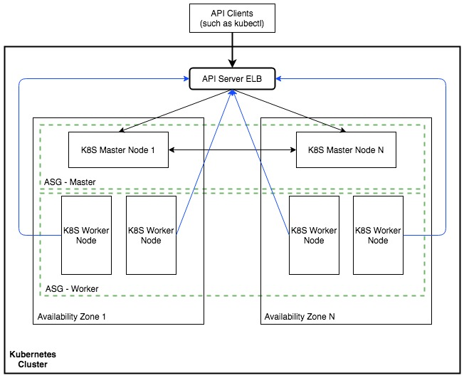

## A Highly Available Microservices Architecture

<figure>

    <figcaption>The Cluster is designed to achieve Highly Available Kubernetes in one region and N availability zones. </figcaption>
</figure>

   
One master node per zone, associated with one Autoscalling Group for all zones.

One API ELB associated with one API FQDN for serving API requests.

Multiple Worker nodes per zone, associated with one Autoscalling Group for all zones.

Worker ASG associates itself with the API ELB to register its worker nodes for load distribution. When autoscaling workers, the ELB is automatically notified of new worker nodes.
   
### Infrastructure as a code
Terraform would be a very good option for Kubernetes Cluster Deployment and Managing Kubernetes Resources as well.
   

### CI/CD strategies
To achieve effecient CI/CD for microservice applications I would recommend to use Jenkins Pipeline as Code. It is free and has a huge community support, lots of Plugins to speeding up writing easy pipeline code.

Through Github or other SCM webhook trigger, jenkins can automatically clone the code if any changes occured in the codebase.

Based on the environement it will start building the docker image, Push the docker image to docker registry, deploy the image into K8S Cluster, Start automated tests. After succesfully tested on the Test Environment, we can decide whether it will go Production or not.
   

### Architecture Observability
Kubernetes Dashboard, Metric Server, and an appropriate Service Mesh (eg. Istio) can improve the Architecture Observability.
   
### Monitoring
Prometheus Monitoring tool is a big relief for Monitoring and Alerting Cloud Native Applications with in Kubernetes Cluster.
   
### Justification for Cloud Solution amonge On-premise, Cloud, and Hybrid.
In such scenario, I would go for Cloud Solution. It gives a huge flexibility in terms of High Availability, Application Scaling, Bandwidth Consumption, Fault Tolerance, ease integration of different typs of Services such as CDN etc. But, there is an issue with Cloud Providers as there is no local datacener of any of the cloud providers (AWS, Azure, GCP) yet. It increases the latency between users and applications.

